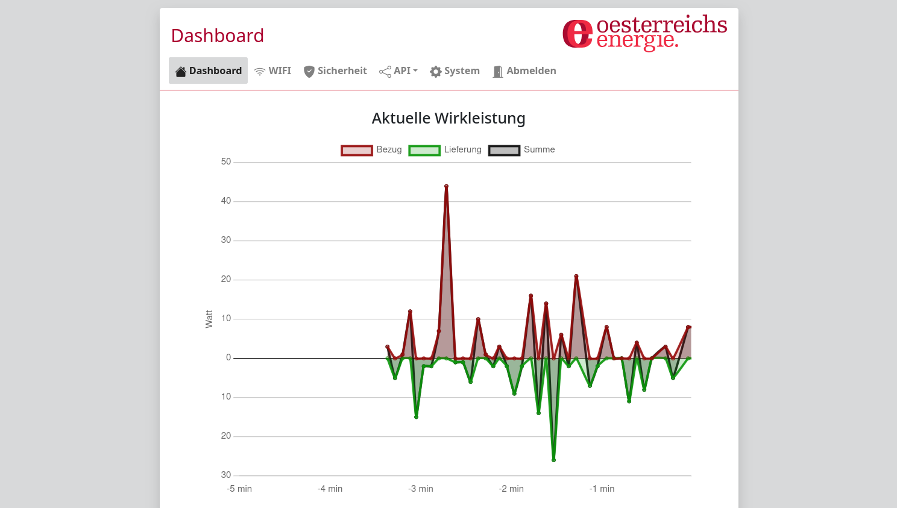
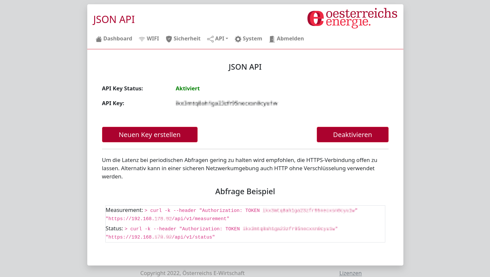
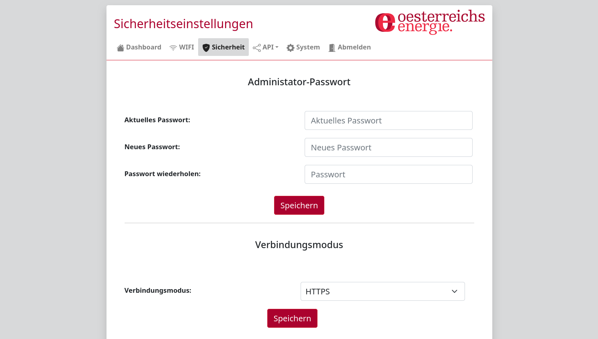

# Smart Meter Adapter (SMA) Setup Guide

This guide covers the initial setup of the Smart Meter Adapter (SMA) from unboxing to a working JSON API token. The same steps apply whether you use the [Home Assistant integration](https://github.com/fabianwimberger/homeassistant-sma) or the [SMA Energy Tracker](https://github.com/fabianwimberger/sma-energy-tracker).

## What You Need

- A Smart Meter Adapter (SMA) device
- A smart meter already installed by your grid operator (Netzbetreiber)
- Your **Zählerschlüssel** (encryption key) — request this from your Netzbetreiber if you don't have it
- A smartphone or laptop with WiFi

## First-Time Setup

1. **Power on** the SMA using the included USB-C cable. Wait for the LED to turn **solid blue** (up to 30 seconds).
2. On your phone or laptop, connect to the WiFi network named `energie_<serial>` (the password is `energie1`).
3. A setup wizard should open automatically. If it doesn't, open a browser and go to `http://192.168.100.1`.

## Setup Wizard

Follow the on-screen wizard:

1. **Set an admin password** — choose something you'll remember; you'll need it later.
2. **Pick your meter** from the list the SMA discovers.
3. **Enter your Zählerschlüssel** when prompted and paste it in.
4. **Confirm the connection check** shows "OK".
5. **Choose HTTPS-only** (recommended) for encrypted communication.
6. **Connect to your home WiFi** and enter your network credentials.

The SMA will reboot and join your home network.

## Find the Device After Reboot

After the reboot:

- Try `http://sma.local` in your browser, **or**
- Use the IP address shown at the end of the wizard.

Write down the IP — you'll need it for the integration or tracker.

## Enable the JSON API

To let our software talk to the SMA, you need to create an API token:

1. Open the SMA web interface.
2. Go to **Dashboard → API → JSON**.
3. Click **"Neuen Key erstellen"**.
4. Click **"Aktivieren"**.
5. **Copy the token** — this is your `SMA_TOKEN`.

  
   <em>Dashboard showing live power and energy counters</em>

  
   <em>API → JSON page where you create the authorization token</em>

  
   <em>Security settings with HTTPS toggle</em>

## What to Plug Into Our Software

Use these values when configuring the integration or tracker:

| Setting | Value | Example |
|---------|-------|---------|
| Host | IP address or `sma.local` | `192.168.1.100` |
| Token | The JSON API key you just copied | `abc123...` |
| HTTPS | Enabled (recommended) | `true` |
| Verify SSL | Disabled — the SMA uses a self-signed certificate | `false` |

## LED Status Reference

| LED Color | State |
|-----------|-------|
| Orange (solid) | Booting (up to 30 seconds) |
| Green (solid) | Connected to WiFi, ready |
| Blue (solid) | AP mode — connect directly via `energie_*` WiFi |
| Red (solid) | Meter read error or WiFi failure |
| Turquoise (solid) | Recovery mode |

---

The SMA's official Bedienungsanleitung from Österreichs Energie covers hardware variants, status LED meanings, and MQTT/Modbus configuration we don't use. Available at <https://oesterreichsenergie.at/smart-meter/technische-leitfaeden>.
